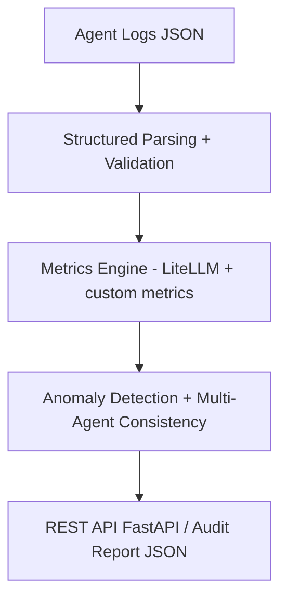

# DCL Eval Pipeline — Demo

> Intended audience: AI leads / architects in fintech & gov who need a concrete evaluation layer for agent behavior audit.

[](https://github.com/DariRinch/dcl-eval-pipeline-demo/actions/workflows/main.yml)
[](https://www.python.org/)
[](https://github.com/confident-ai/deepeval)

[](https://colab.research.google.com/github/DariRinch/dcl-eval-pipeline-demo/blob/main/notebooks/demo.ipynb)

Lightweight evaluation pipeline for **monitoring, auditing** and **explaining** behavior of LLM agents in multi-agent systems.

---

## For whom

For AI teams in fintech, government and enterprise building multi-agent systems
who need **deterministic audit**, full traceability and compliance with
EU AI Act / ФСТЭК requirements.

---

## Motivation

In 2026, multi-agent LLM systems are deployed in fintech, government,
and enterprise — but their decisions remain a **black box**.

This pipeline is a practical step toward **deterministic audit**,
observability, and explainability: anomaly detection in decision chains,
prompt quality & consistency assessment, full traceability.

**Example:** detect when an agent silently ignores a KYC rule,
loops on a decision chain, or produces hallucinated reasoning
in a critical workflow.

---

## Key Features

* **Prompt quality assessment** — clarity, completeness, ambiguity detection
* **Multi-agent consistency check** — two agents, same input, diverging outputs = flag
* **Anomaly detection** in decision chains — loops, hallucination in reasoning
* **REST API** via FastAPI — any external system can request an audit report in JSON
* **Vendor lock-in avoidance** via LiteLLM — swap model in `config.yaml`, no code changes
* **Structured audit logging** — JSON logs with action tracing and tool calls
* **Containerized** — runs anywhere via Docker
* **CI/CD** — automated lint + Docker build on every push

---

## Architecture


Core components:

* `eval/pipeline.py` — evaluation orchestration
* `eval/metrics.py` — custom metrics
* `prompts/templates.py` — prompt templates for LLM evaluators
* `api/main.py` — FastAPI endpoint `POST /evaluate`
* `config.yaml` — model, thresholds, paths (swap model in one line)
* `data/sample_logs.json` — sample agent logs

---

## Installation
```bash
# 1. Clone
git clone https://github.com/DariRinch/dcl-eval-pipeline-demo.git
cd dcl-eval-pipeline-demo

# 2. Install dependencies
pip install -r requirements.txt

# 3. Set up environment
cp .env.example .env
# → add HF_TOKEN=hf_your_token_here
```

## Quick Start
```bash
# Run notebook demo
jupyter notebook notebooks/demo.ipynb

# Or run API
uvicorn api.main:app --reload
```

## API Usage
```bash
curl -X POST http://localhost:8000/evaluate \
  -H "Content-Type: application/json" \
  -d '{
    "template": "decision_audit",
    "kwargs": {"scenario": "Flag transaction of $47,000 from a new account"}
  }'
```

---

## Docker
```bash
docker build -t dcl-eval-pipeline .
docker run -p 8888:8888 dcl-eval-pipeline
```

---

## Roadmap

* [x] Core eval pipeline + metrics
* [x] Multi-agent consistency check
* [x] FastAPI endpoint
* [x] LiteLLM integration
* [x] Docker + CI/CD
* [ ] LangGraph / CrewAI integration
* [ ] Streamlit / Gradio dashboard
* [ ] Export to Langfuse / Phoenix / OpenTelemetry
* [ ] Golden datasets + regression tests

---

## Status

Active research project. Core architecture is under IP protection.
This repository contains the public demo layer.

---

## Contact

Issues welcome → [github.com/DariRinch](https://github.com/DariRinch)
