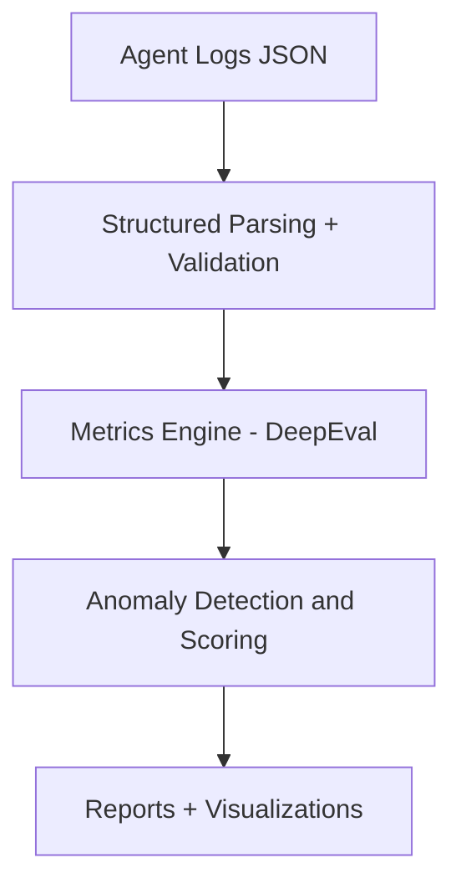

# DCL Eval Pipeline — Demo

[](https://www.python.org/)
[](https://github.com/confident-ai/deepeval)
[](https://github.com/DariRinch/dcl-eval-pipeline-demo)

Lightweight evaluation pipeline for **monitoring, auditing** and **explaining** behavior of LLM agents in multi-agent systems.

---

## Motivation

In 2026, multi-agent LLM systems are deployed in fintech, government, 
and enterprise — but their decisions remain a **black box**.

This pipeline is a practical step toward **deterministic audit**, 
observability, and explainability: anomaly detection in decision chains, 
prompt quality & consistency assessment, full traceability.

Goal: align systems with EU AI Act, ISO standards, and high explainability 
levels — enabling humans to truly trust and control autonomous agents.

---

## Key Features

- **Prompt quality assessment** — clarity, completeness, ambiguity detection
- **Response consistency** — contradiction detection across agent responses
- **Anomaly detection** in decision chains — loops, hallucination in reasoning
- **Structured agent logging** — JSON logs with action tracing and tool calls
- **Extensible metrics** via DeepEval (G-Eval, custom LLM-as-a-judge)
- **Interactive demo** in Jupyter — see the pipeline on sample logs

---

## Architecture


Core components:
- [`eval/pipeline.py`](eval/pipeline.py) — evaluation orchestration
- [`eval/metrics.py`](eval/metrics.py) — custom and built-in metrics
- [`prompts/templates.py`](prompts/templates.py) — prompt templates for LLM evaluators
- [`data/sample_logs.json`](data/sample_logs.json) — sample agent logs

---

## Installation
```bash
# 1. Clone
git clone https://github.com/DariRinch/dcl-eval-pipeline-demo.git
cd dcl-eval-pipeline-demo

# 2. Install dependencies
pip install -r requirements.txt

# 3. Set up API key
cp .env.example .env
# → edit .env and add your OPENAI_API_KEY=sk-...
```

## Quick Start
```bash
jupyter notebook notebooks/demo.ipynb
```

---

## Roadmap

- [x] Core eval pipeline + metrics
- [x] Sample logs + .env setup
- [x] Jupyter demo notebook structure
- [ ] LangGraph / CrewAI integration
- [ ] Agent-specific metrics: goal achievement, loop/hallucination detection
- [ ] Multi-LLM support via LiteLLM
- [ ] Streamlit / Gradio dashboard
- [ ] Export to Langfuse / Phoenix / OpenTelemetry
- [ ] Golden datasets + regression tests
- [ ] CLI for batch log evaluation

---

## Status

Active research project. Core architecture is under IP protection.  
This repository contains the public demo layer.

---

## Related Concepts

This work draws from:
- [DeepEval](https://github.com/confident-ai/deepeval) — LLM evaluation framework
- Agent observability patterns (Langfuse, Phoenix, OpenTelemetry)
- AI Safety research on monitoring, alignment and explainability
- EU AI Act requirements for transparent and auditable AI systems

---
  
## Contact

Issues welcome → [github.com/DariRinch](https://github.com/DariRinch)
